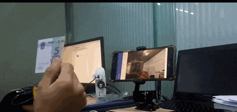
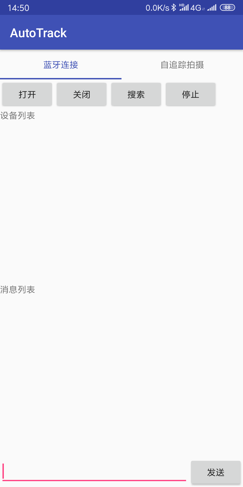

# AutoTrack

2018年参加广东省电子设计大赛时的作品，当时拿了省一等奖。作品效果如下：

软件界面如下：

作品分为软件部分（Android application）和硬件部分（arduino），两者通过蓝牙连接。硬件部分很简单，只是简单地接收蓝牙数据然后控制舵机转向，运用到了一点点PID算法。

这里开源的是**软件部分**，只支持Android，不支持IOS。

## 项目详情

本项目基于Android Studio开发，这里是精简过后的文件结构，删去了build后的内容，导入Android Studio能正常使用。

其中最重要的人脸跟踪部分使用了[虹软](http://www.arcsoft.com.cn/technology/face.html)的免费so库，基于虹软自己的演示demo进行修改，删除了人脸识别功能，只保留了人脸跟踪部分的功能，另外加入了蓝牙功能。

## 通信协议

字母|含义|速度
:--:|:--:|:--:
a|舵机不动|0
b|舵机向下转动|很慢
c|舵机向下转动|慢
d|舵机向下转动|快
e|舵机向下转动|很快
f|舵机向上转动|很慢
g|舵机向上转动|慢
h|舵机向上转动|快
i|舵机向上转动|很快
l|舵机向左转动|很慢
m|舵机向左转动|慢
n|舵机向左转动|快
o|舵机向左转动|很快
r|舵机向右转动|很慢
s|舵机向右转动|慢
t|舵机向右转动|快
u|舵机向右转动|很快

## 遗留问题

蓝牙功能很不稳定，特别是连接蓝牙的时候极容易崩溃，目前没有改进的想法。希望借鉴者注意。

## 开源协议

MIT License
